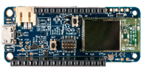

# MQTT client with XENSIV&trade; sensors – PAS CO2

## Overview

This code example demonstrates implementing an MQTT client using the [MQTT client library](https://github.com/Infineon/mqtt) for  XENSIV&trade; sensor with Infineon connectivity devices. The library uses the following:

 - AWS IoT device SDK MQTT client library that includes an MQTT 3.1.1 client

 - sensor-xensiv-pasco2 library that is configured to detect the CO2 presence

In this example, the MQTT client RTOS task establishes a connection with the configured MQTT broker, and creates three tasks - publisher, subscriber, and PASCO2. The publisher task publishes messages on the  `MQTT_PUB_TOPIC` topic when a new CO2 value is read back. The subscriber task subscribes to `MQTT_SUB_TOPIC`. The PASCO2 task initializes a context object of the pasco2 library and continuously reads the CO2 data from the sensor module. <br>

From 'pasco2_task', there is another PAS CO2 configuration task created to enable dynamically configuring the sensor-xensiv-pasco2 library. From the MQTT broker, you can send JSON message to the MQTT client within `MQTT_SUB_TOPIC` to perform the configuration. <br>

[View this README on GitHub.](https://github.com/Infineon/mtb-example-sensors-pasco2-anycloud-mqtt-client)

[Provide feedback on this code example.](https://cypress.co1.qualtrics.com/jfe/form/SV_1NTns53sK2yiljn?Q_EED=eyJVbmlxdWUgRG9jIElkIjoiQ0UyMzMyMzYiLCJTcGVjIE51bWJlciI6IjAwMi0zMzIzNiIsIkRvYyBUaXRsZSI6Ik1RVFQgY2xpZW50IHdpdGggWEVOU0lWJnRyYWRlOyBzZW5zb3JzIOKAkyBQQVMgQ08yIiwicmlkIjoid3V5YW5nIiwiRG9jIHZlcnNpb24iOiIxLjAuMCIsIkRvYyBMYW5ndWFnZSI6IkVuZ2xpc2giLCJEb2MgRGl2aXNpb24iOiJNQ0QiLCJEb2MgQlUiOiJTQlNZUyIsIkRvYyBGYW1pbHkiOiJTVUJTWVMifQ==)


## Sequence of operation

1. A new CO2 value is read from the module.

2. The pasco2_task notifies the publisher task with the new CO2 value.

3. The publisher task publishes this new CO2 data to the remote server on a topic defined. You can verify this data from the MQTT broker.

4. The MQTT broker sends the configuration as a JSON string to this client to configure the 'sensor-xensiv-pasco2' library. This allows the example to perform remote configuration.

**Notes:**

1. pasco2_task is suspended if the PAS CO2 wing board is not connected.

2. Check the sensor-xensiv-pasco2 library documentation for information on configuration JSON objects.

<br>

## Requirements

- [ModusToolbox&trade; software](https://www.cypress.com/products/modustoolbox-software-environment) v2.2 or later

    **Note:** This code example version requires ModusToolbox software version 2.2 or later and is not backward compatible with v2.1 or older versions.

- Board support package (BSP) minimum required version: 2.0.0
- Programming language: C
- Associated parts: All [PSoC&trade; 6 MCU](http://www.cypress.com/PSoC6) parts with SDIO, AIROC™ CYW43012 Wi-Fi & Bluetooth® combo chip,  AIROC™ CYW4343W Wi-Fi & Bluetooth® combo chip


## Supported toolchains (make variable 'TOOLCHAIN')

- GNU Arm® embedded compiler v9.3.1 (`GCC_ARM`) - Default value of `TOOLCHAIN`


## Supported kits (make variable 'TARGET')

- PSoC&trade; 6 rapid IoT connect platform RP01 feather kit (`CYSBSYSKIT-DEV-01`) - Default value of `TARGET`

**Note:** This example requires a PSoC&trade; 6 MCU device with at least 2 MB flash and 1 MB SRAM, and therefore does not support other PSoC&trade; 6 MCU kits.


## Hardware setup

This code example requires the XENSIV™ PAS CO2 wing board as part of the connected sensor lit.

1. Connect the PAS CO2 wing board to the CYSBSYSKIT-DEV-01 kit with the pin headers.

2. Connect the CYSBSYSKIT-DEV-01 kit to the PC with a USB cable.

3. Place the CYSBSYSKIT-DEV-01 kit at a location in a room which is not very high.

   **Rapid IoT connect platform RP01 feather kit (CYSBSYSKIT-DEV-01)**

   

   **XENSIV™ PAS CO2 wing board**

   


## Software setup

Install a terminal emulator if you don't have one. Instructions in this document use [Tera Term](https://ttssh2.osdn.jp/index.html.en).

This example requires no additional software or tools.


## Using the code example

Create the project and open it using one of the following:

<details><summary><b>In Eclipse IDE for ModusToolbox&trade; software</b></summary>

1. Click the **New application** link in the **quick panel** (or, use **File** > **New** > **ModusToolbox&trade; application**). This launches the [project creator](http://www.cypress.com/ModusToolboxProjectCreator) tool.

2. Pick a kit supported by the code example from the list shown in the **Project creator - Choose board support package (BSP)** dialog.

   When you select a supported kit, the example is reconfigured automatically to work with the kit. To work with a different supported kit later, use the [library manager](https://www.cypress.com/ModusToolboxLibraryManager) to choose the BSP for the supported kit. You can use the library manager to select or update the BSP and firmware libraries used in this application. To access the library manager, click the link from the **quick panel**.

   You can also just start the application creation process again and select a different kit.

   If you want to use the application for a kit not listed here, you may need to update the source files. If the kit does not have the required resources, the application may not work.

3. In the **Project creator - Select application** dialog, choose the example by enabling the checkbox.

4. Optionally, change the suggested **New application name**.

5. Enter the local path in the **Application(s) root path** field to indicate where the application needs to be created.

   Applications that can share libraries can be placed in the same root path.

6. Click **Create** to complete the application creation process.

For more details, see the [Eclipse IDE for ModusToolbox&trade; software user guide](https://www.cypress.com/MTBEclipseIDEUserGuide) (locally available at *{ModusToolbox&trade; install directory}/ide_{version}/docs/mt_ide_user_guide.pdf*).

</details>

<details><summary><b>In command-line interface (CLI)</b></summary>

ModusToolbox&trade; provides the project creator as both a GUI tool and a command line tool to easily create one or more ModusToolbox&trade; applications. See the "Project creator tools" section of the [ModusToolbox&trade; user guide](https://www.cypress.com/ModusToolboxUserGuide) for more details.

Alternatively, you can manually create the application using the following steps:

1. Download and unzip this repository onto your local machine, or clone the repository.

2. Open a CLI terminal and navigate to the application folder.

   On Windows, use the command line "modus-shell" program provided in the ModusToolbox&trade; installation instead of a standard Windows command line application. This shell provides access to all ModusToolbox&trade; tools. You can access it by typing `modus-shell` in the search box in the Windows menu.

   In Linux and macOS, you can use any terminal application.

   **Note:** The cloned application contains a default BSP file (*TARGET_xxx.mtb*) in the *deps* folder. Use the [library manager](https://www.cypress.com/ModusToolboxLibraryManager) (`make modlibs` command) to select and download a different BSP file, if required. If the selected kit does not have the required resources or is not [supported](#supported-kits-make-variable-target), the application may not work.

3. Import the required libraries by executing the `make getlibs` command.

Various CLI tools include a `-h` option that prints help information to the terminal screen about that tool. For more details, see the [ModusToolbox&trade; user guide](https://www.cypress.com/ModusToolboxUserGuide) (locally available at *{ModusToolbox&trade; install directory}/docs_{version}/mtb_user_guide.pdf*).

</details>

<details><summary><b>In third-party IDEs</b></summary>

1. Follow the instructions from the **In command-line interface (CLI)** section to create the application, and import the libraries using the `make getlibs` command.

2. Export the application to a supported IDE using the `make <ide>` command.

    For a list of supported IDEs and more details, see the "Exporting to IDEs" section of the [ModusToolbox&trade; user guide](https://www.cypress.com/ModusToolboxUserGuide) (locally available at *{ModusToolbox&trade; install directory}/docs_{version}/mtb_user_guide.pdf*.

3. Follow the instructions displayed in the terminal to create or import the application as an IDE project.

</details>


## Operation

1. Connect the board to your PC using the provided USB cable through the KitProg3 USB connector.

2. Modify the user configuration files in the *configs* directory as follows:

      1. **Wi-Fi configuration:** Set the Wi-Fi credentials in *configs/wifi_config.h*: Modify the macros `WIFI_SSID`, `WIFI_PASSWORD`, and `WIFI_SECURITY` to match with that of the Wi-Fi network that you want to connect.

      2. **MQTT configuration:** Set up the MQTT client and configure the credentials in *configs/mqtt_client_config.h*. Some of the important configuration macros are as follows:

         - `MQTT_BROKER_ADDRESS` – Hostname of the MQTT broker

         - `MQTT_PORT` – Port number to be used for the MQTT connection. As specified by IANA (Internet Assigned Numbers Authority), port numbers assigned for MQTT protocol are *1883* for non-secure connections and *8883* for secure connections. However, MQTT brokers may use other ports. Configure this macro as specified by the MQTT broker.

         - `MQTT_SECURE_CONNECTION` – Set this macro to `1` if a secure (TLS) connection to the MQTT broker is  required to be established; else `0`.

         - `MQTT_USERNAME` and `MQTT_PASSWORD` – User name and password for client authentication and authorization, if required by the MQTT broker. However, note that this information is generally not encrypted and the password is sent in plain text. Therefore, this is not a recommended method of client authentication.

         - `CLIENT_CERTIFICATE` and `CLIENT_PRIVATE_KEY` – Certificate and private key of the MQTT client used for client authentication. Note that these macros are applicable only when `MQTT_SECURE_CONNECTION` is set to `1`.

         - `ROOT_CA_CERTIFICATE` – Root CA certificate of the MQTT broker

         See [Setting up the MQTT broker](#setting-up-the-mqtt-broker) to learn how to configure these macros for AWS IoT and Mosquitto MQTT brokers.

         For a full list of configuration macros used in this code example, see [Wi-Fi and MQTT configuration macros](#wi-fi-and-mqtt-configuration-macros).

      3. Other configuration files: You can optionally modify the configuration macros in the following files according to your application:

         - *configs/core_mqtt_config.h* used by the [MQTT library](https://github.com/Infineon/mqtt)

         - *configs/FreeRTOSConfig.h* used by the [FreeRTOS library](https://github.com/Infineon/freertos)

3. Open a terminal program and select the KitProg3 COM port. Set the serial port parameters to 8N1 and 115200 baud.

4. Program the board using one of the following:

   <details><summary><b>Using Eclipse IDE for ModusToolbox&trade; software</b></summary>

      1. Select the application project in the project explorer.

      2. In the **quick panel**, scroll down, and click **\<Application name> Program (KitProg3_MiniProg4)**.
   </details>

      <details><summary><b>Using CLI</b></summary>

     From the terminal, execute the `make program` command to build and program the application using the default toolchain to the default target. You can specify a target and toolchain manually:
      ```
      make program TARGET=<BSP> TOOLCHAIN=<toolchain>
      ```

      Example:
      ```
      make program TARGET=CYSBSYSKIT-DEV-01 TOOLCHAIN=GCC_ARM
      ```
   </details>

   After programming, the application starts automatically. Observe the messages on the UART terminal, and wait for the device to make all the required connections.

   **Figure 1. Application initialization status**

   

5. Once the initialization is complete, confirm that subscription to the topic is successful.

6. If PAS CO2 wing boards are connected and PSoC™ 6 reads new CO2 data back successfully, the following messages are displayed in Tera Term:

   **Figure 2. Get new CO2 data**

   

   And go to AWS IoT-Core, on the left side bar open `MQTT test client` from `Test` menu to subscribe `MQTT_PUB_TOPIC`, which is **pasco2_status**. You should see the following:

   **Figure 3. Get new CO2 data on the MQTT broker**

   

7. When you configure the device from the MQTT broker (first half of Figure 4), the configuration JSON message will be sent to the device within `MQTT_SUB_TOPIC`. The message will be printed out in Tera Term terminal. Besides, the device will check and apply the configuration, and give feedback to the MQTT broker (second half of Figure 4).

   **Figure 4. Receive configuration message on MQTT broker**

   

   **Note:** The warning message appears only because the received message is not in JSON format.


   **Figure 5. Receive configuration message**

   

   **Table 1. Configuration JSON objects**

   (See XENSIV&trade; PAS CO2 library documentation)

   | Key  |  Default value     | valid values |
   | :------- | :------------    | :--------------------|
   | `pasco2_measurement_period` | 10 | 10 - 4095 s|

8. Confirm that the following messages are printed when no wing boards are connected.

   **Figure 6. No wing board connected**

   

This example can be programmed on multiple kits (*Only when `GENERATE_UNIQUE_CLIENT_ID` is set to `1`*).

Alternatively, the publish and subscribe functionalities of the MQTT client can be individually verified if the MQTT broker supports a Test MQTT client like the AWS IoT.

- *To verify the subscribe functionality*: Using the Test MQTT client, publish messages on the topic specified by the `MQTT_SUB_TOPIC` macro in *mqtt_client_config.h*

- *To verify the publish functionality*: From the Test MQTT client, subscribe to the MQTT topic specified by the `MQTT_PUB_TOPIC` macro and confirm that the messages published by the kit are displayed on the Test MQTT client's console.


### Sensor information and LEDs

The initialization process is indicated by blinking red LED on CYSBSYSKIT-DEV-01. The LED is turned OFF after a successful connection to MQTT server; the OK LED on the PAS CO2 Wing Board is turned ON to show that the board is working normally. If this LED is OFF, check the connection with CYSBSYSKIT-DEV-01.

When the sensor gives a new value for CO2, it is displayed on the terminal. If a new value is not available, the state of the sensor is displayed on the terminal. If an out-of-range voltage or temperature error occurs, the warning LED on the CO2 wing board is turned ON. If the problem is resolved by the time of the next sample, the warning LED is turned OFF. The LED remaining ON indicates a problem with the voltage, temperature, or communication. Contact the sensor support team.


## Debugging


You can debug the example to step through the code. In the IDE, use the **\<Application name> Debug (KitProg3_MiniProg4)** configuration in the **quick panel**. For details, see the "Program and debug" section in the [Eclipse IDE for ModusToolbox&trade; software user guide](https://www.cypress.com/MTBEclipseIDEUserGuide).

**Note:** **(Only while debugging)** On the CM4 CPU, some code in `main()` may execute before the debugger halts at the beginning of `main()`. This means that some code executes twice – once before the debugger stops execution, and again after the debugger resets the program counter to the beginning of `main()`. See [KBA231071](https://community.cypress.com/docs/DOC-21143) to learn about this and for the workaround.


## Design and implementation

This example implements three RTOS tasks: MQTT client, publisher, and subscriber. The main function initializes the BSP and the retarget-io library, and creates the MQTT client task.

The MQTT client task initializes the Wi-Fi connection manager (WCM) and connects to a Wi-Fi access point (AP) using the Wi-Fi network credentials that are configured in *wifi_config.h*. Upon a successful Wi-Fi connection, the task initializes the MQTT library and establishes a connection with the MQTT broker/server.

The MQTT connection is configured to be secure by default; the secure connection requires a client certificate, a private key, and the root CA certificate of the MQTT broker that are configured in *mqtt_client_config.h*.

After a successful MQTT connection, the subscriber and publisher tasks are created. The MQTT client task then waits for commands from the other two tasks and callbacks to handle events like unexpected disconnections.

The subscriber task initializes the user LED GPIO and subscribes to messages on the topic specified by the `MQTT_SUB_TOPIC` macro that can be configured in *mqtt_client_config.h*. When the subscriber task receives a message from the broker, it turns the user LED ON.

The publisher task sets up the user button GPIO and configures an interrupt for the button. The ISR notifies the publisher task upon a button press. The publisher task then publishes messages (*TURN ON* / *TURN OFF*) on the topic specified by the `MQTT_PUB_TOPIC` macro. When the publish operation fails, a message is sent over a queue to the MQTT client task.

An MQTT event callback function `mqtt_event_callback()` invoked by the MQTT library for events like MQTT disconnection and incoming MQTT subscription messages from the MQTT broker. In the case of an MQTT disconnection, the MQTT client task is informed about the disconnection using a message queue. When an MQTT subscription message is received, the subscriber callback function implemented in *subscriber_task.c* is invoked to handle the incoming MQTT message.

The MQTT client task handles unexpected disconnections in the MQTT or Wi-Fi connections by initiating reconnection to restore the Wi-Fi and/or MQTT connections. Upon failure, the publisher and subscriber tasks are deleted, cleanup operations of various libraries are performed, and then the MQTT client task is terminated.

**Note:** The CY8CPROTO-062-4343W board shares the same GPIO for the user button (USER BTN) and the CYW4343W host wakeup pin. Because this example uses the GPIO for interfacing with the user button to toggle the LED, the SDIO interrupt to wake up the host is disabled by setting `CY_WIFI_HOST_WAKE_SW_FORCE` to '0' in the Makefile through the `DEFINES` variable.


### Configuring the MQTT client

#### Wi-Fi and MQTT configuration macros

 Macro                               |  Description
 :---------------------------------- | :------------------------
 **Wi-Fi connection configurations**  |  In *configs/wifi_config.h*
 `WIFI_SSID`       | SSID of the Wi-Fi AP to which the MQTT client connects
 `WIFI_PASSWORD`   | Passkey/password for the Wi-Fi SSID specified above
 `WIFI_SECURITY`   | Security type of the Wi-Fi AP. See the `cy_wcm_security_t` structure in *cy_wcm.h* for details.
 `MAX_WIFI_CONN_RETRIES`   | Maximum number of retries for Wi-Fi connection
 `WIFI_CONN_RETRY_INTERVAL_MS`   | Time interval in milliseconds in between successive Wi-Fi connection retries
 **MQTT connection configurations**  |  In *configs/mqtt_client_config.h*
 `MQTT_BROKER_ADDRESS`      | Hostname of the MQTT broker
 `MQTT_PORT`                | Port number to be used for the MQTT connection. As specified by IANA, port numbers assigned for MQTT protocol are *1883* for non-secure connections and *8883* for secure connections. However, MQTT brokers may use other ports. Configure this macro as specified by the MQTT broker.
 `MQTT_SECURE_CONNECTION`   | Set this macro to `1` if a secure (TLS) connection to the MQTT broker is  required to be established; else `0`.
 `MQTT_USERNAME` <br> `MQTT_PASSWORD`   | User name and password for client authentication and authorization, if required by the MQTT broker. However, note that this information is generally not encrypted and the password is sent in plain text. Therefore, this is not a recommended method of client authentication.
 **MQTT client certificate configurations**  |  In *configs/mqtt_client_config.h*
 `CLIENT_CERTIFICATE` <br> `CLIENT_PRIVATE_KEY`  | Certificate and private key of the MQTT client used for client authentication. Note that these macros are applicable only when `MQTT_SECURE_CONNECTION` is set to `1`.
 `ROOT_CA_CERTIFICATE`      |  Root CA certificate of the MQTT broker
 **MQTT message configurations**    |  In *configs/mqtt_client_config.h*
 `MQTT_PUB_TOPIC`           | MQTT topic to which the messages are published by the publisher task to the MQTT broker
 `MQTT_SUB_TOPIC`           | MQTT topic to which the subscriber task subscribes to. The MQTT broker sends the messages to the subscriber that are published in this topic (or equivalent topic).
 `MQTT_MESSAGES_QOS`        | The quality of service (QoS) level to be used by the publisher and subscriber. Valid choices are `0`, `1`, and `2`.
 `ENABLE_LWT_MESSAGE`       | Set this macro to `1` if you want to use the 'last will and testament (LWT)' option; else `0`. LWT is an MQTT message that will be published by the MQTT broker on the specified topic if the MQTT connection is unexpectedly closed. This configuration is sent to the MQTT broker during MQTT connect operation; the MQTT broker will publish the will message on the will topic when it recognizes an unexpected disconnection from the client.
 `MQTT_WILL_TOPIC_NAME` <br> `MQTT_WILL_MESSAGE`   | The MQTT topic and message for the LWT option described above. These configurations are applicable only when `ENABLE_LWT_MESSAGE` is set to `1`.
 **Other MQTT client configurations**    |  In *configs/mqtt_client_config.h*
 `GENERATE_UNIQUE_CLIENT_ID`   | Every active MQTT connection must have a unique client identifier. If this macro is set to `1`, the device will generate a unique client identifier by appending a timestamp to the string specified by the `MQTT_CLIENT_IDENTIFIER` macro. This feature is useful if you are using the same code on multiple kits simultaneously.
 `MQTT_CLIENT_IDENTIFIER`     | The client identifier (client ID) string to be used during MQTT connection. If `GENERATE_UNIQUE_CLIENT_ID` is set to `1`, a timestamp is appended to this macro value and used as the client ID; else, the value specified for this macro is directly used as the client ID.
 `MQTT_CLIENT_IDENTIFIER_MAX_LEN`   | The longest client identifier that an MQTT server must accept (as defined by the MQTT 3.1.1 spec) is 23 characters. However, some MQTT brokers support longer client IDs. Configure this macro as per the MQTT broker specification.
 `MQTT_TIMEOUT_MS`            | Timeout in milliseconds for MQTT operations in this example
 `MQTT_KEEP_ALIVE_SECONDS`    | The keepalive interval in seconds used for MQTT ping request
 `MQTT_ALPN_PROTOCOL_NAME`   | The application layer protocol negotiation (ALPN) protocol name to be used that is supported by the MQTT broker in use. Note that this is an optional macro for most of the use cases. <br>Per IANA, the port numbers assigned for MQTT protocol are 1883 for non-secure connections and 8883 for secure connections. In some cases, there is a need to use other ports for MQTT like port 443 (which is reserved for HTTPS). ALPN is an extension to TLS that allows many protocols to be used over a secure connection.
 `MQTT_SNI_HOSTNAME`   | The server name indication (SNI) host name to be used during the transport layer security (TLS) connection as specified by the MQTT broker. <br>SNI is extension to the TLS protocol. As required by some MQTT brokers, SNI typically includes the hostname in the "Client Hello" message sent during the TLS handshake.
 `MQTT_NETWORK_BUFFER_SIZE`   | A network buffer is allocated for sending and receiving MQTT packets over the network. Specify the size of this buffer using this macro. Note that the minimum buffer size is defined by the `CY_MQTT_MIN_NETWORK_BUFFER_SIZE` macro in the MQTT library.
 `MAX_MQTT_CONN_RETRIES`   | Maximum number of retries for MQTT connection
 `MQTT_CONN_RETRY_INTERVAL_MS`   | Time interval in milliseconds in between successive MQTT connection retries

<br>

### Setting up the MQTT broker

#### **AWS IoT MQTT**

1. Set up the MQTT device (also known as a *Thing*) in the AWS IoT core as described in the [Getting started with AWS IoT tutorial](https://docs.aws.amazon.com/iot/latest/developerguide/iot-gs.html).

    **Note:** While setting up your device, ensure that the policy associated with this device permits all MQTT operations (*iot:Connect*, *iot:Publish*, *iot:Receive*, and *iot:Subscribe*) for the resource used by this device. For testing purposes, it is recommended to have the following policy document which allows all *MQTT Policy Actions* on all *Amazon Resource Names (ARNs)*.
    ```
    {
        "Version": "2012-10-17",
        "Statement": [
            {
                "Effect": "Allow",
                "Action": "iot:*",
                "Resource": "*"
            }
        ]
    }
    ```

2. In the *configs/mqtt_client_config.h* file, set `MQTT_BROKER_ADDRESS` to your custom endpoint on the **Settings** page of the AWS IoT console. This has the format `ABCDEFG1234567.iot.<region>.amazonaws.com`.

3. Set the macros `MQTT_PORT` to `8883` and `MQTT_SECURE_CONNECTION` to `1` in the *configs/mqtt_client_config.h* file.

4. Download the following certificates and keys that are created and activated in the previous step:
    - A certificate for the AWS IoT Thing – *xxxxxxxxxx.certificate.pem.crt*
    - A public key – *xxxxxxxxxx.public.pem.key*
    - A private key – *xxxxxxxxxx.private.pem.key*
    - Root CA "RSA 2048 bit key: Amazon Root CA 1" for AWS IoT from [CA Certificates for Server Authentication](https://docs.aws.amazon.com/iot/latest/developerguide/server-authentication.html#server-authentication-certs) – *xxxxxxxxxx.AmazonRootCA1.pem*

 5. Using these certificates and keys, enter the following parameters in *mqtt_client_config.h* in Privacy-Enhanced Mail (PEM) format:
    - `CLIENT_CERTIFICATE` – *xxxxxxxxxx.certificate.pem.crt*
    - `CLIENT_PRIVATE_KEY` – *xxxxxxxxxx.private.pem.key*
    - `ROOT_CA_CERTIFICATE` – *xxxxxxxxxx.AmazonRootCA1.pem*

    You can either convert the values to strings manually following the format shown in *mqtt_client_config.h* or you can use the HTML utility available [here](https://github.com/Infineon/amazon-freertos/blob/master/tools/certificate_configuration/PEMfileToCString.html) to convert the certificates and keys from PEM format to C string format. You need to clone the repository from GitHub to use the utility.

#### **Local Mosquitto broker**

Download and install the Mosquitto broker for your PC from https://mosquitto.org/download. The following instructions help in setting up the Mosquitto broker for a secure connection with the client using self-signed SSL certificates. This requires **OpenSSL** which is already preloaded in the ModusToolbox&trade; software installation. Run the following commands with a CLI (on Windows, use the command line "modus-shell" program provided in the ModusToolbox&trade; software installation instead of the standard Windows command-line application).

1. Generate the CA certificate for the Mosquitto broker / server using the following commands. Follow the instructions in the command window to provide the details required.
   ```
   openssl genrsa -out ca.key 2048
   openssl req -new -x509 -sha256 -nodes -days 365 -key ca.key -out ca.crt
   ```

2. Generate the server key pair and server certificate (signed using the CA certificate from Step 1) for the Mosquitto broker using the following commands. Follow the instructions in the command window to provide the details required.
   ```
   openssl genrsa -out server.key 2048
   openssl req -new -nodes -sha256 -key server.key -out server.csr
   openssl x509 -req -sha256 -in server.csr -CA ca.crt -CAkey ca.key -CAcreateserial -out server.crt -days 365
   ```

   At this stage, the certificates and keys required by the Mosquitto broker are ready. The files used from these steps are *ca.crt*, *server.crt*, and *server.key*.

3. Create a configuration file for the Mosquitto broker - *mosquitto.conf* with the following contents and provide the path to the generated credentials (*ca.crt*, *server.crt*, and *server.key*) under the *SSL settings* section.
    ```
   # Config file for mosquitto
   connection_messages true
   per_listener_settings true
   listener 8883
   require_certificate true
   use_identity_as_username true
   allow_anonymous false
   cafile <path-to-ca.crt>
   keyfile <path-to-server.key>
   certfile <path-to-server.crt>
   ```

4. Start the Mosquitto broker with the configurations from the above *mosquitto.conf* file using the following command. If the *mosquitto.conf* file is present in a different location from where the command is run, provide the path to the config file after the `-c` argument.
   ```
   mosquitto -v -c mosquitto.conf
   ```

5. Generate the client certificates using the following commands. Follow the instructions in the command window to provide the details required. Note that the last command requires *ca.crt* and *ca.key* files generated in Step 2.
   ```
   openssl genrsa -out client.key 2048
   openssl req -new -out client.csr -key client.key
   openssl x509 -req -in client.csr -CA ca.crt -CAkey ca.key -CAcreateserial -out client.crt -days 365
   ```

6. Configure the MQTT client configurations in *configs/mqtt_client_config.h* as follows:

     - Set `MQTT_BROKER_ADDRESS` as the IP address of the PC running the Mosquitto broker (the PC on which Step 4 is performed).

     - Set `MQTT_PORT` as `8883`.

     - Set `MQTT_SECURE_CONNECTION` as `1`.

     - Using the client certificate (*client.crt*), private key (*client.key*), and root CA certificate (*ca.crt*) from the above steps, configure the `CLIENT_CERTIFICATE`, `CLIENT_PRIVATE_KEY`, and `ROOT_CA_CERTIFICATE` macros respectively.

       You can either convert the PEM format values to strings manually following the format shown in *mqtt_client_config.h* or you can use the HTML utility available [here](https://github.com/Infineon/amazon-freertos/blob/master/tools/certificate_configuration/PEMfileToCString.html) to convert the certificates and keys from PEM format to C string format. You need to clone the repository from GitHub to use the utility.

Although this section provides instructions only for AWS IoT and the local Mosquitto broker, the MQTT client implemented in this example is generic. It is expected to work with other MQTT brokers with appropriate configurations. See the [list of publicly-accessible MQTT brokers](https://github.com/mqtt/mqtt.github.io/wiki/public_brokers) that can be used for testing and prototyping purposes.

### Resources and settings

**Table 2. Application source files**

|File name            |Comments         |
| ------------------------|-------------------- |
| *main.c* |Contains the application entry point. It initializes the UART for debugging and then initializes the controller tasks|
| *mqtt_client_config.c* |Global variables for MQTT connection|
| *mqtt_task.c* |Contains the task function to: <br> 1. Establish an MQTT connection <br> 2. Start publisher and subscriber tasks <br> 3. Start the PASCO2 task|
| *publisher_task.c* |Contains the task function to publish message to the MQTT broker|
| *subscriber_task.c* |Contains the task function to subscribe messages from the MQTT broker|
| *pasco2_task.c* |Contains the task function to get the CO2 value from the sensor|
| *pasco2_config_task.c* |Contains the task function to configure the sensor-xensiv-pasco2 library |

<br>

## Related resources

Resources  | Links
-----------|----------------------------------
Application notes  |[AN228571](https://www.cypress.com/AN228571) – Getting started with PSoC&trade; 6 MCU on ModusToolbox&trade; software <br> [AN215656](https://www.cypress.com/AN215656) – PSoC&trade; 6 MCU: dual-CPU system design
Code examples  | [Using ModusToolbox&trade; software](https://github.com/Infineon/Code-Examples-for-ModusToolbox-Software) on GitHub
Device documentation | [PSoC&trade; 6 MCU datasheets](https://www.cypress.com/search/all?f[0]=meta_type%3Atechnical_documents&f[1]=resource_meta_type%3A575&f[2]=field_related_products%3A114026) <br> [PSoC&trade; 6 technical reference manuals](https://www.cypress.com/search/all/PSoC%206%20Technical%20Reference%20Manual?f[0]=meta_type%3Atechnical_documents&f[1]=resource_meta_type%3A583)
Development kits | [CYSBSYSKIT-DEV-01](https://github.com/Infineon/TARGET_CYSBSYSKIT-DEV-01) rapid IoT connect developer kit
Libraries on GitHub  | [mtb-pdl-cat1](https://github.com/infineon/mtb-pdl-cat1) – PSoC&trade; 6 peripheral driver library (PDL)  <br> [mtb-hal-cat1](https://github.com/infineon/mtb-hal-cat1) – Hardware abstraction layer (HAL) library <br> [retarget-io](https://github.com/infineon/retarget-io) – Utility library to retarget STDIO messages to a UART port <br> [sensor-xensiv-pasco2](https://github.com/Infineon/sensor-xensiv-pasco2) – PAS CO2 library API to configure the PAS CO2 sensor and get ppm values  <br>  [sensor-xensiv-dps3xx](https://github.com/Infineon/sensor-xensiv-dps3xx) – DPS3xx library API to configure the DPS3xx sensor and get the pressure and temperature values
Middleware on GitHub  | [mqtt](https://github.com/Infineon/mqtt) – MQTT client library and docs <br> [wifi-connection-manager](https://github.com/Infineon/wifi-connection-manager) – Wi-Fi connection manager (WCM) library and docs <br> [wifi-mw-core](https://github.com/Infineon/wifi-mw-core) – Wi-Fi middleware core library and docs <br> [psoc6-middleware](https://github.com/Infineon/modustoolbox-software#psoc-6-middleware-libraries) – Links to all PSoC&trade; 6 MCU middleware
Tools  | [Eclipse IDE for ModusToolbox&trade; software](https://www.cypress.com/modustoolbox) – ModusToolbox&trade; software is a collection of easy-to-use software and tools enabling rapid development with Infineon MCUs, covering applications from embedded sense and control to wireless and cloud-connected systems using AIROC&trade; Wi-Fi and Bluetooth® connectivity devices.


## Other resources

Cypress provides a wealth of data at www.cypress.com to help you select the right device, and quickly and effectively integrate it into your design.

For PSoC&trade; 6 MCU devices, see [How to design with PSoC&trade; 6 MCU - KBA223067](https://community.cypress.com/docs/DOC-14644) in the Cypress community.

## Document history

Document title: *CE233236* – *MQTT client with XENSIV&trade; sensors – PAS CO2*

| Version | Description of change |
| ------- | --------------------- |
| 0.6.0   | New code example.     |
| 1.0.0   | Upgrade to MQTT-v3.X. |

------

All other trademarks or registered trademarks referenced herein are the property of their respective owners.

---------

© Cypress Semiconductor Corporation, 2020-2021. This document is the property of Cypress Semiconductor Corporation, an Infineon Technologies company, and its affiliates ("Cypress").  This document, including any software or firmware included or referenced in this document ("Software"), is owned by Cypress under the intellectual property laws and treaties of the United States and other countries worldwide.  Cypress reserves all rights under such laws and treaties and does not, except as specifically stated in this paragraph, grant any license under its patents, copyrights, trademarks, or other intellectual property rights.  If the Software is not accompanied by a license agreement and you do not otherwise have a written agreement with Cypress governing the use of the Software, then Cypress hereby grants you a personal, non-exclusive, nontransferable license (without the right to sublicense) (1) under its copyright rights in the Software (a) for Software provided in source code form, to modify and reproduce the Software solely for use with Cypress hardware products, only internally within your organization, and (b) to distribute the Software in binary code form externally to end users (either directly or indirectly through resellers and distributors), solely for use on Cypress hardware product units, and (2) under those claims of Cypress’s patents that are infringed by the Software (as provided by Cypress, unmodified) to make, use, distribute, and import the Software solely for use with Cypress hardware products.  Any other use, reproduction, modification, translation, or compilation of the Software is prohibited.
<br>
TO THE EXTENT PERMITTED BY APPLICABLE LAW, CYPRESS MAKES NO WARRANTY OF ANY KIND, EXPRESS OR IMPLIED, WITH REGARD TO THIS DOCUMENT OR ANY SOFTWARE OR ACCOMPANYING HARDWARE, INCLUDING, BUT NOT LIMITED TO, THE IMPLIED WARRANTIES OF MERCHANTABILITY AND FITNESS FOR A PARTICULAR PURPOSE.  No computing device can be absolutely secure.  Therefore, despite security measures implemented in Cypress hardware or software products, Cypress shall have no liability arising out of any security breach, such as unauthorized access to or use of a Cypress product.  CYPRESS DOES NOT REPRESENT, WARRANT, OR GUARANTEE THAT CYPRESS PRODUCTS, OR SYSTEMS CREATED USING CYPRESS PRODUCTS, WILL BE FREE FROM CORRUPTION, ATTACK, VIRUSES, INTERFERENCE, HACKING, DATA LOSS OR THEFT, OR OTHER SECURITY INTRUSION (collectively, "Security Breach").  Cypress disclaims any liability relating to any Security Breach, and you shall and hereby do release Cypress from any claim, damage, or other liability arising from any Security Breach.  In addition, the products described in these materials may contain design defects or errors known as errata which may cause the product to deviate from published specifications.  To the extent permitted by applicable law, Cypress reserves the right to make changes to this document without further notice. Cypress does not assume any liability arising out of the application or use of any product or circuit described in this document.  Any information provided in this document, including any sample design information or programming code, is provided only for reference purposes.  It is the responsibility of the user of this document to properly design, program, and test the functionality and safety of any application made of this information and any resulting product.  "High-Risk Device" means any device or system whose failure could cause personal injury, death, or property damage.  Examples of High-Risk Devices are weapons, nuclear installations, surgical implants, and other medical devices.  "Critical Component" means any component of a High-Risk Device whose failure to perform can be reasonably expected to cause, directly or indirectly, the failure of the High-Risk Device, or to affect its safety or effectiveness.  Cypress is not liable, in whole or in part, and you shall and hereby do release Cypress from any claim, damage, or other liability arising from any use of a Cypress product as a Critical Component in a High-Risk Device.  You shall indemnify and hold Cypress, including its affiliates, and its directors, officers, employees, agents, distributors, and assigns harmless from and against all claims, costs, damages, and expenses, arising out of any claim, including claims for product liability, personal injury or death, or property damage arising from any use of a Cypress product as a Critical Component in a High-Risk Device.  Cypress products are not intended or authorized for use as a Critical Component in any High-Risk Device except to the limited extent that (i) Cypress’s published data sheet for the product explicitly states Cypress has qualified the product for use in a specific High-Risk Device, or (ii) Cypress has given you advance written authorization to use the product as a Critical Component in the specific High-Risk Device and you have signed a separate indemnification agreement.
<br>
Cypress, the Cypress logo, and combinations thereof, WICED, ModusToolBox, PSoC™, CapSense, EZ-USB, F-RAM, and Traveo are trademarks or registered trademarks of Cypress or a subsidiary of Cypress in the United States or in other countries.  For a more complete list of Cypress trademarks, visit cypress.com.  Other names and brands may be claimed as property of their respective owners.
